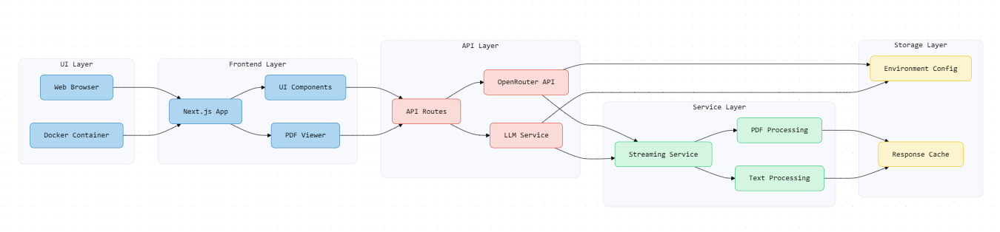

## Challenge Koch-a-doc

### Architecture Diagram



- Blue components (UI Layer) handle user interactions and frontend components
- Green components (Service Layer) manage processing and business logic
- Red components (API Layer) handle external service integration
- Yellow components (Storage Layer) manage configuration and caching


The application consists of several key components that work together to process PDFs and handle AI interactions:

### UI Components

* **PDFViewer.tsx**: Handles PDF display and interaction
* **DebugTab.tsx**: Provides debugging interface
* **Navbar.tsx**: Navigation system
* **UI Components**: Reusable UI elements

### Processing Components

* **pdf-parser.ts**: Processes PDF content
* **export-config.tsx**: Manages export configurations
* **pdf-upload.tsx**: Handles PDF file uploads

### API Integration

* **LlmClientExample.tsx**: Manages LLM interactions
* **Response Cache**: Handles cached results


## Getting Started

There are two ways to run this application: directly on your machine or using Docker.

First, run the development server:

```bash
npm run dev
# or
yarn dev
# or
pnpm dev
# or
bun dev
```

Open [http://localhost:3000](http://localhost:3000) with your browser to see the result.

You can start editing the page by modifying `app/page.tsx`. The page auto-updates as you edit the file.

This project uses [`next/font`](https://nextjs.org/docs/app/building-your-application/optimizing/fonts) to automatically optimize and load [Geist](https://vercel.com/font), a new font family for Vercel.

### API Key Setup

This application requires an OpenRouter API key to function:

1. Create an account at [OpenRouter](https://openrouter.ai)
2. Generate an API key at [https://openrouter.ai/keys](https://openrouter.ai/keys)
3. Copy the `.env.example` file to `.env` in the project root:
   ```
   cp .env.example .env
   ```
4. Add your OpenRouter API key to the `.env` file:
   ```
   OPENAPI_KEY=your_openrouter_api_key_here
   ```

### Streaming Responses

This application uses streaming for OpenAI/OpenRouter API responses, offering several benefits:

1. **Reduced Wait Times**: Content appears progressively as it's generated
2. **Handling Large Output**: Prevents truncation issues with large PDF outputs
3. **Better User Experience**: Provides real-time feedback during processing

For technical details on how streaming is implemented, see [STREAMING.md](STREAMING.md).

## Docker Deployment

The application can also be run using Docker, which simplifies setup by packaging all dependencies including Node.js and the required Python tools:

1. Make sure Docker and Docker Compose are installed on your system.

2. Run the application using the provided helper script:
   ```bash
   ./docker-run.sh
   ```

3. For development mode with hot reloading:
   ```bash
   ./docker-run.sh --dev
   ```

4. To force a rebuild of the Docker image:
   ```bash
   ./docker-run.sh --build
   ```

For more detailed instructions on Docker deployment, see [DOCKER.md](DOCKER.md).

### Required Dependencies

When running with Docker, all dependencies are included in the container. When running locally, you'll need:

- Node.js 20+
- Yarn or npm
- Python 3.x with pip
- The markitdown Python package: `pip install 'markitdown[all]'`

## Deployment Options

### Deploy on Vercel

The easiest way to deploy your Next.js app is to use the [Vercel Platform](https://vercel.com/new?utm_medium=default-template&filter=next.js&utm_source=create-next-app&utm_campaign=create-next-app-readme) from the creators of Next.js.

### Deploy with Docker

To deploy in production using Docker:

1. Build the production Docker image:
   ```bash
   docker compose build
   ```

2. Run the container:
   ```bash
   docker compose up -d
   ```

This will run the application in a container with all required dependencies, including the markitdown CLI tool.

## Feature Highlights

- **PDF Processing**: Extract structured data from PDF documents
- **Multiple AI Models**: Supports various OpenRouter models including Claude, GPT, Gemini, and Llama
- **Streaming Responses**: Real-time streaming output for large document processing
- **Debug Mode**: Raw markdown view for debugging extracted content
